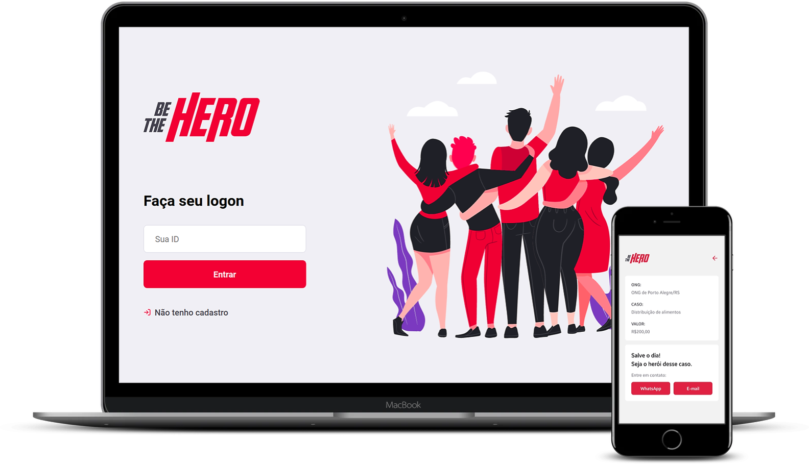

<h1 align="center">
    
</h1>

  <a href="#question-about">About</a>&nbsp;&nbsp;&nbsp;|&nbsp;&nbsp;&nbsp;
  <a href="#rocket-techs">Techs</a>&nbsp;&nbsp;&nbsp;|&nbsp;&nbsp;&nbsp;
  <a href="#wrench-setting-up-and-running-the-app">Running the app</a>&nbsp;&nbsp;&nbsp;|&nbsp;&nbsp;&nbsp;
  <a href="#memo-license">License</a>

 

  

## :question: About

Be The Hero connects NGOs that need help to people who are willed to help monetarily.

## :rocket: Techs

This project was developed with the following technologies:

- [Node.js](https://nodejs.org/en/)
- [React](https://reactjs.org)
- [React Native](https://facebook.github.io/react-native/)
- [Expo](https://expo.io/)

## :wrench: Setting up and running the app

### Starting the server

- in `backend` folder, run `yarn install` to install the dependencies
- run `yarn start` to start the server and watch mode

### Starting the web app

- in `frontend` folder, run `yarn install` to install the dependencies
- run `yarn start` to start the app

### Starting the mobile app

- in `mobile` folder, run `yarn install` to install the dependencies
- run `yarn start` to start the app
- Scan the QR code shown in your desktop using the Expo mobile app

### :heavy_plus_sign: Extra TODOs

- Login validation (e-mail confirmation, reset password, etc)
- Include a NGO profile page to display more informations about it
- Store geolocalization information about the NGO
- Allow the user to set a maximum distance on the case list page, showing cases only from NGOs located within the distance reported by the user

## :memo: License

This project is under MIT license. Read [LICENSE](LICENSE.md) file for more details.

---

Developed with ♥ by Maurício Cantú. 2020.
